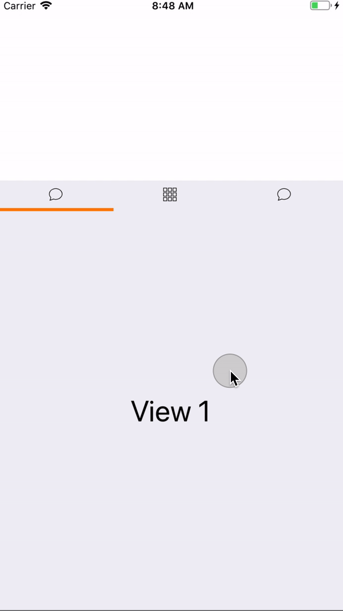
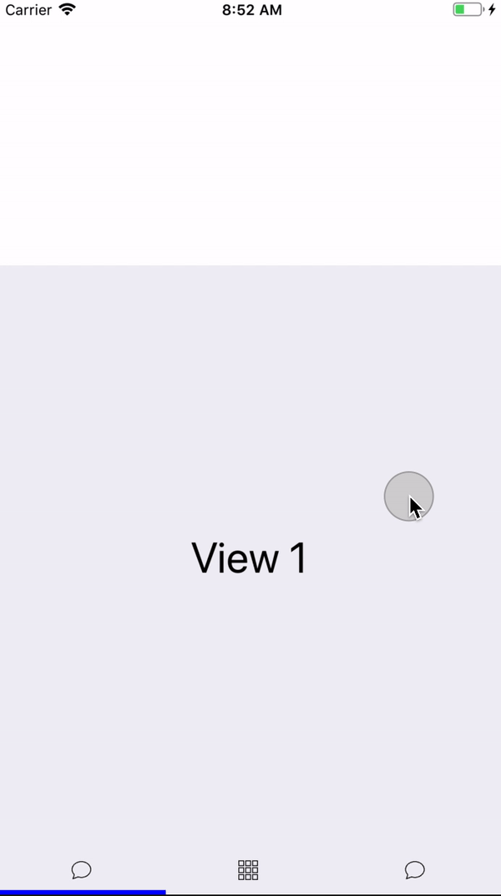
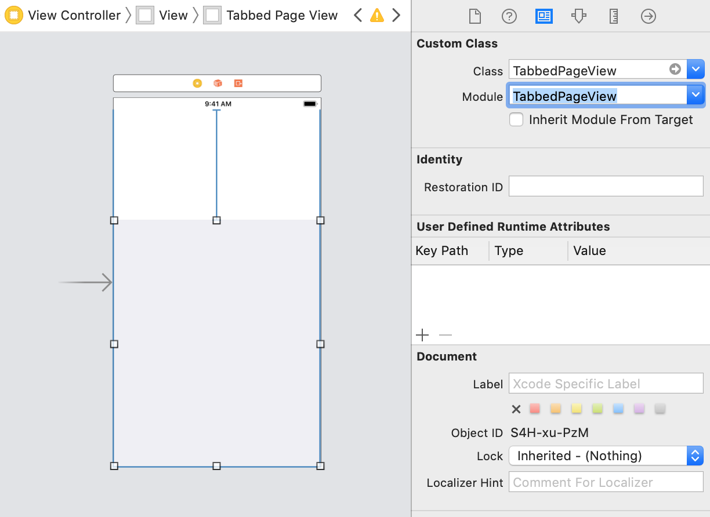
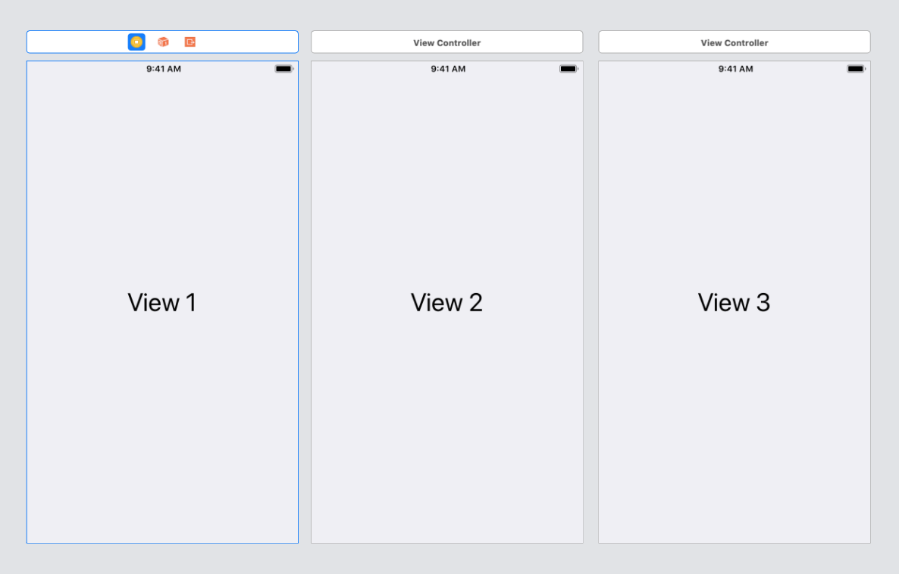

# TabbedPageView

## Overview

TabbedPageView is a UIView subclass that allows you to quickly create a tabbed subview anywhere in your application

<div style="display:flex;">
  
  
</div>

## Usage Example

### Step 1

Add a UIView to your view controller in storyboard and specify its class as ```TabbedPageView```



### Step 2

Create an outlet for the TabbedPageView in your code from your storyboard
```swift
@IBOutlet weak var tabbedPageView: TabbedPageView!
```

### Step 3

Create the view controllers that will represent your tabs in the ```TabbedPageView```



### Step 4

Extend your UIViewController class to conform to the ```TabbedPageViewDataSource``` protocol
```swift
extension ViewController: TabbedPageViewDataSource {
    
    func tabs() -> [Tab] {
        let controller1 = UIStoryboard(name: "Main", bundle: nil).instantiateViewController(withIdentifier: "View1")
        let controller2 = UIStoryboard(name: "Main", bundle: nil).instantiateViewController(withIdentifier: "View2")
        let controller3 = UIStoryboard(name: "Main", bundle: nil).instantiateViewController(withIdentifier: "View3")
        
        return [
            Tab(viewController: controller1, iconImage: UIImage(named: "TabIcon1")!),
            Tab(viewController: controller2, iconImage: UIImage(named: "TabIcon2")!),
            Tab(viewController: controller3, iconImage: UIImage(named: "TabIcon3")!)
        ]
    }
    
    func sliderColor() -> UIColor {
        return UIColor.blue
    }
    
    func tabBarPosition() -> TabBarPosition {
        return .bottom
    }
}
```

Here's a breakdown of the required DataSource methods

```func tabs() -> [Tab]``` - The array of ```Tab```s the view will contain. Each tab will have its own ```viewController``` and ```iconImage```

```func sliderColor() -> UIColor``` - The color of the slider bar that highlights the currently selected tab

```func tabBarPosition() -> TabBarPosition``` - The position of the tab bar in the view. Currently there are only two options: ```.top``` or ```.bottom```

### Step 5

In your controller's viewDidLoad method, specify the TabbedPageView's data source and delegate and reload the view

```swift
override func viewDidLoad() {
    super.viewDidLoad()

    tabbedPageView.delegate = self
    tabbedPageView.dataSource = self
    tabbedPageView.reloadData()
}
```
